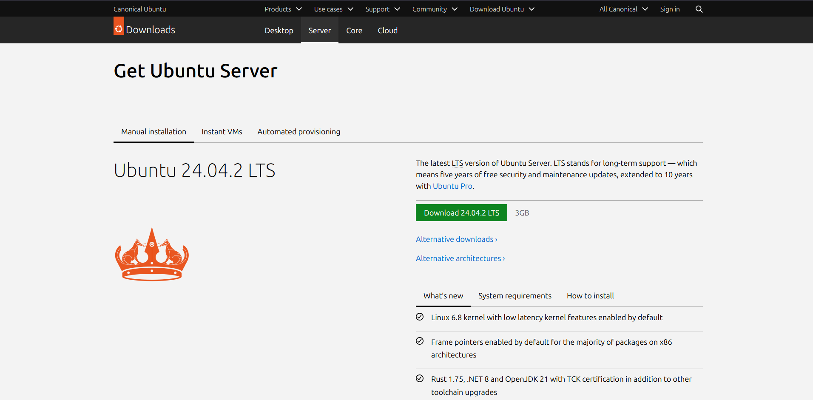

# Handleiding voor het opzetten de omgeving

In deze handleiding wordt uitgelegd hoe je de omgeving voor het project kunt opzetten. De omgeving wordt opgezet met behulp van Vbox manage.

## Stap 1: Download de benodigde software en bestanden

Om de omgeving op te zetten, gebruik je de Ubuntu Server 24.04 LTS ISO, die je kunt downloaden van de [Ubuntu website](https://ubuntu.com/download/server).



Plaats deze ISO in een map op je computer waar je gemakkelijk bij kunt en onthoud de locatie van deze map. Je moet deze locatie later invoeren in het script dat de VM's aanmaakt. Voor het gemak plaats je deze in een ISO map in je home directory.

Kopieer het pad naar de map waarin je de ISO hebt geplaatst. In Windows kun je dit eenvoudig doen door de ISO te selecteren en op Ctrl + Shift + C te drukken. Dit kopieert het pad naar het bestand.

Daarnaast heb je de `src` map van deze repository nodig. Deze map bevat alle configuratiebestanden die nodig zijn om de omgeving op te zetten. Maak dus een clone van deze repository.

## Stap 2: Pas de variabelen aan in het script

Om het script te kunnen gebruiken, moet je de volgende variabelen aanpassen:

```powershell
$VM_VDI_PATH = "C:\Users\gille\VirtualBox VMs"  # Pad waar de virtuele schijf wordt opgeslagen
$VM_ISO_PATH = "C:\ISOs\ubuntu-server.iso"  # Pad naar de Ubuntu Server ISO
```
